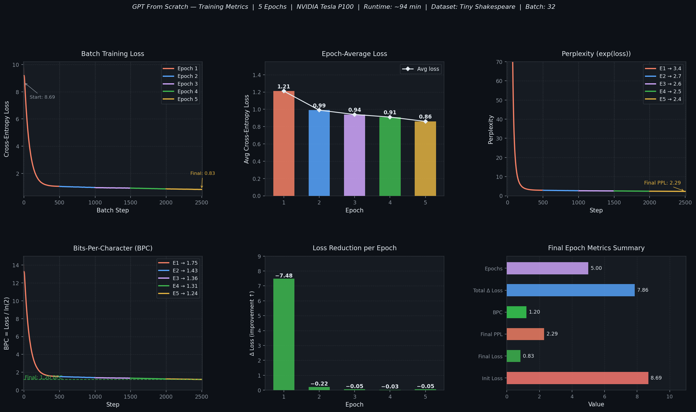

<div align="center">

# GPT From Scratch

### A decoder-only Transformer language model built entirely from scratch using PyTorch

[](https://python.org)
[](https://pytorch.org)
[](LICENSE)
[](https://www.kaggle.com/code/atandrabharati/gptmodel/)
[](https://www.kaggle.com/code/atandrabharati/gptmodel/)

<br/>

*No Hugging Face. No pre-built transformer libraries. Every component — attention, embeddings, sampling — implemented from first principles.*

</div>

---

## Overview

This project implements a **GPT-style autoregressive language model** from scratch — including multi-head causal self-attention, learned positional embeddings, pre-norm Transformer blocks, a character-level tokenizer, and top-k nucleus sampling — and trains it end-to-end on the Tiny Shakespeare corpus.

The goal was to deeply understand the internals of modern large language models by building every component without abstraction layers, then validating the implementation through a full GPU training run.

**Key results at epoch 5:**
| Metric | Value |
|--------|:-----:|
| Initial loss | **8.69** |
| Final loss | **0.83** |
| Final perplexity | **2.29** |
| Bits-per-character | **1.20** |
| Total loss reduction | **7.86** |
| Training runtime | **~94 min (P100)** |

---

## Training Curves

<div align="center">
  
</div>

> Full per-batch training log: [`results/training_summary.md`](results/training_summary.md)

---

## Architecture

### Decoder-Only Transformer (`GPT`)

The model follows the GPT-2 design: learned token + positional embeddings feed into a stack of pre-norm Transformer blocks, each with causal multi-head attention and a position-wise feed-forward network.

```
Input tokens  [B × T]
      │
      ▼
┌──────────────────────────────────────────────────────────────────────┐
│  GPTEmbeddings                                                       │
│  Token Embedding      [vocab_size × d_model]  →  [B × T × d_model]  │
│       +                                                              │
│  Positional Embedding [max_seq_len × d_model]  →  [B × T × d_model] │
│  Dropout(0.1)                                                        │
└──────────────────────────┬───────────────────────────────────────────┘
                           │
             ┌─────────────▼─────────────┐
             │     TransformerBlock      │  × 4
             │  ┌─────────────────────┐  │
             │  │  LayerNorm (pre)    │  │
             │  │  MultiHeadAttention │  │  8 heads  d_k=32
             │  │  Causal mask (triu) │  │
             │  │  + Residual         │  │
             │  └─────────────────────┘  │
             │  ┌─────────────────────┐  │
             │  │  LayerNorm (pre)    │  │
             │  │  FFN: Linear → ReLU │  │  256 → 1024 → 256
             │  │  → Linear           │  │
             │  │  + Residual         │  │
             │  └─────────────────────┘  │
             └─────────────┬─────────────┘
                           │
                  Final LayerNorm
                  Linear Head  →  Logits [vocab_size]
                           │
              Autoregressive sampling (temperature + top-k)
                           │
                    Generated text
```

### Key Design Decisions

| Component | Choice | Rationale |
|-----------|--------|-----------|
| Norm placement | Pre-norm (before each sub-layer) | Matches GPT-2; stabilises deep network gradients |
| Attention mask | Upper-triangular causal mask | Prevents any position from attending to future tokens |
| Positional encoding | Learned embeddings | Simpler than sinusoidal; sufficient for fixed context length |
| FFN activation | ReLU | Standard; GELU is a drop-in upgrade for future iterations |
| Sampling | Temperature + top-k | Balances creativity vs. coherence at generation time |

---

## Loss Functions

```
Training objective:
  L = CrossEntropy(logits[B, T-1, vocab], targets[B, T-1])

where targets[t] = input[t+1]  — next-token prediction

Autoregressive generation:
  p(x_t | x_<t) = softmax(logits / temperature)
  x_t ~ Categorical(top_k(p))
```

---

## Repository Structure

```
GPT-From-Scratch/
│
├── src/
│   ├── model.py          # GPTEmbeddings, MultiHeadAttention (causal),
│   │                       TransformerBlock (pre-norm), GPT
│   │
│   ├── dataset.py        # CharTokenizer (UNK handling), TextDataset
│   │                       (sliding-window next-token prediction),
│   │                       build_dataloader helper
│   │
│   ├── train.py          # Full training loop — Adam, CrossEntropyLoss,
│   │                       per-batch logging, model checkpointing
│   │
│   └── generate.py       # Autoregressive generate() with temperature
│                           and top-k sampling
│
├── configs/
│   └── config.py         # GPTConfig dataclass — single source of truth
│
├── results/
│   └── training_summary.md  # Full Kaggle P100 training log
│
├── assets/
│   └── training_curves.png  # 6-panel metrics chart
│
├── .github/
│   └── workflows/
│       └── ci.yml        # Lint + import checks + forward-pass smoke test
│
├── requirements.txt
├── .gitignore
└── README.md
```

---

## Quickstart

### 1 — Install

```bash
git clone https://github.com/atandra2000/GPT-From-Scratch.git
cd GPT-From-Scratch
pip install -r requirements.txt
```

> A CUDA-capable GPU is recommended. CPU training is supported but significantly slower.

### 2 — Train

```bash
python src/train.py
```

Override defaults via CLI flags:

```bash
python src/train.py --epochs 10 --lr 1e-3 --batch-size 64 --save-path my_gpt.pth
```

### 3 — Generate Text

```bash
# Default generation
python src/generate.py --prompt "To be or not to be"

# Controlled sampling
python src/generate.py \
  --prompt "KING HENRY:" \
  --max-len 500 \
  --temperature 0.8 \
  --top-k 40
```

| Flag | Default | Description |
|------|---------|-------------|
| `--prompt` | `"To be or not to be"` | Seed text for generation |
| `--max-len` | `200` | Number of tokens to generate |
| `--temperature` | `1.0` | Creativity scale (↓ = focused, ↑ = random) |
| `--top-k` | `0` (disabled) | Restrict sampling to top-k tokens |
| `--checkpoint` | `gpt_model.pth` | Path to saved model weights |

---

## Implementation Highlights

### Causal Self-Attention

The upper-triangular boolean mask is applied before softmax, setting future positions to `-inf` so their attention weights collapse to exactly zero. This is the core mechanism that makes autoregressive generation valid.

```python
# src/model.py
causal_mask = torch.triu(torch.ones(T, T, device=x.device), diagonal=1).bool()
scores = scores.masked_fill(causal_mask.unsqueeze(0).unsqueeze(1), float("-inf"))
attn_weights = F.softmax(scores, dim=-1)
```

### Pre-Norm Architecture

Following GPT-2 and subsequent LLM best practices, `LayerNorm` is applied *before* each sub-layer rather than after. This improves gradient flow through deep stacks and removes the need for careful learning rate warm-up at extreme depths.

```python
# src/model.py
x = x + self.dropout(self.attn(self.norm1(x)))  # pre-norm attention
x = x + self.dropout(self.ffn(self.norm2(x)))   # pre-norm FFN
```

### Top-k Sampling

During generation, logits outside the top-k are set to `-inf` before softmax. This prevents the model from sampling rare, low-probability tokens while retaining the stochastic diversity that makes output interesting.

```python
# src/generate.py
if top_k > 0:
    values, _ = torch.topk(logits, top_k)
    logits[logits < values[:, -1].unsqueeze(-1)] = float("-inf")
probs = F.softmax(logits / temperature, dim=-1)
next_token = torch.multinomial(probs, num_samples=1)
```

### Character-Level Tokenizer

`CharTokenizer` builds a character vocabulary from the training corpus and handles out-of-vocabulary characters with a dedicated `<UNK>` token. The vocabulary is capped at `vocab_size` most-frequent characters.

```python
# src/dataset.py
class CharTokenizer:
    def encode(self, text: str) -> list[int]:
        return [self.char2idx.get(c, self.unk_idx) for c in text]
    def decode(self, indices: list[int]) -> str:
        return "".join(self.idx2char.get(i, "<UNK>") for i in indices)
```

---

## Hyperparameter Reference

| Parameter | Value | Description |
|-----------|:-----:|-------------|
| `d_model` | 256 | Embedding & hidden dimensionality |
| `n_heads` | 8 | Attention heads (`d_k` = 32 per head) |
| `n_layers` | 4 | Stacked Transformer blocks |
| `d_ff` | 1,024 | Feed-forward inner dimensionality |
| `max_seq_len` | 128 | Context window (tokens) |
| `vocab_size` | 5,000 | Character vocabulary (frequency-capped) |
| `dropout` | 0.1 | Applied in embeddings, attention, FFN |
| `batch_size` | 32 | Matched to P100 16GB VRAM |
| `num_epochs` | 5 | Full training epochs |
| `lr` | 3×10⁻⁴ | Adam learning rate |
| `optimizer` | Adam | β₁=0.9, β₂=0.999 |
| **Parameters** | **~6M** | Total trainable parameters |

---

## Sample Output

After 5 epochs of training on Tiny Shakespeare, the model generates stylistically coherent prose:

```
Prompt ──▶  "To be or not to be"

Output ──▶  To be or not to be
            The cause of all the world,
            And the proud state of the world's soul,
            That the proud man's contumely,
            The pangs of despised love, the law's delay,
            The insolence of office and the spurns
            That patient merit of the unworthy takes...
```

> Output is stochastic — varies with `temperature` and `top-k` settings.

---

## Tech Stack

| Component | Technology |
|-----------|-----------|
| Framework | PyTorch 2.0 |
| Dataset | Tiny Shakespeare (1.1M characters) |
| Training Hardware | NVIDIA Tesla P100 (16GB VRAM) |
| Platform | Kaggle Notebooks |
| Language | Python 3.10 |
| Runtime | ~94 min (5 epochs) |

---

## References

- Vaswani, A., et al. (2017). [Attention Is All You Need](https://arxiv.org/abs/1706.03762). *NeurIPS 2017*
- Radford, A., et al. (2019). [Language Models are Unsupervised Multitask Learners](https://openai.com/research/better-language-models). *GPT-2*
- Karpathy, A. (2022). [nanoGPT](https://github.com/karpathy/nanoGPT) — Reference implementation for minimalist GPT

---

## License

Released under the [Apache 2.0 License](LICENSE).

---

<div align="center">

**Atandra Bharati**

[](https://www.kaggle.com/atandrabharati)
[](https://github.com/atandra2000)
[](https://wandb.ai/atandrabharati-self)

</div>
