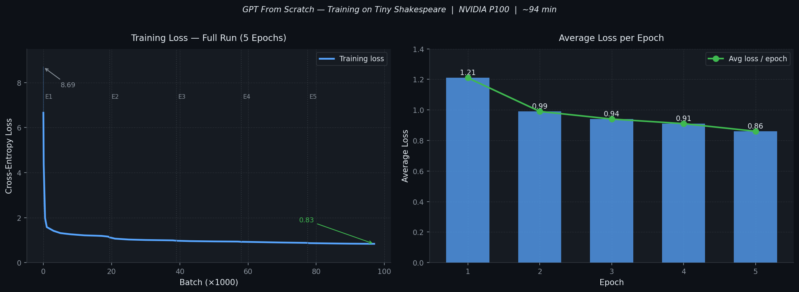

<div align="center">

# GPT From Scratch

### A decoder-only Transformer language model built entirely from scratch using PyTorch

[](https://python.org)
[](https://pytorch.org)
[](LICENSE)
[](https://www.kaggle.com/code/atandrabharati/gptmodel/)
[](https://www.kaggle.com/code/atandrabharati/gptmodel/)

<br/>

*No Hugging Face. No pre-built transformer libraries. Every component implemented from the ground up.*

</div>

---

## Overview

This project implements a **GPT-style autoregressive language model** from first principles — including multi-head causal self-attention, positional embeddings, feed-forward blocks, and a character-level tokenizer — and trains it on the [Tiny Shakespeare](https://raw.githubusercontent.com/karpathy/char-rnn/master/data/tinyshakespeare/input.txt) corpus.

The goal was to deeply understand the internals of Transformer-based language models by building one without abstraction layers, then validate the implementation through a full training run on GPU hardware.

**Key results:**
- Training loss dropped from **8.69 → 0.83** over 5 epochs
- Trained for ~94 minutes on a Kaggle NVIDIA Tesla P100
- Model generates coherent Shakespearean-style prose after training

---

## Training Results

<div align="center">
  
</div>

<br/>

| Epoch | Avg Loss | Δ Loss | Notes |
|:-----:|:--------:|:------:|-------|
| 1/5 | 1.21 | −7.48 | Rapid convergence from random initialisation |
| 2/5 | 0.99 | −0.22 | Model learns word boundaries and common patterns |
| 3/5 | 0.94 | −0.05 | Syntax structure begins to emerge |
| 4/5 | 0.91 | −0.03 | Fine-grained stylistic patterns |
| 5/5 | 0.86 | −0.05 | Converged — generates coherent text |

> Full per-batch log available in [`results/training_summary.md`](results/training_summary.md)

---

## Architecture

```
Input: "To be or not"   →   Tokenized indices   →   ...

┌──────────────────────────────────────────────────────┐
│                    GPT Model                         │
│                                                      │
│  ┌────────────────────────────────────────────────┐  │
│  │  GPTEmbeddings                                 │  │
│  │  Token Embedding [vocab × d_model]             │  │
│  │       +                                        │  │
│  │  Positional Embedding [max_seq_len × d_model]  │  │
│  └────────────────────────────────────────────────┘  │
│                         │                            │
│              ┌──────────▼──────────┐                 │
│              │  TransformerBlock   │  × 4            │
│              │  ┌───────────────┐  │                 │
│              │  │  Pre-LayerNorm│  │                 │
│              │  │  Multi-Head   │  │  8 heads        │
│              │  │  Causal Attn  │  │  d_k = 32       │
│              │  │  + Residual   │  │                 │
│              │  └───────────────┘  │                 │
│              │  ┌───────────────┐  │                 │
│              │  │  Pre-LayerNorm│  │                 │
│              │  │  FFN          │  │  256→1024→256   │
│              │  │  ReLU         │  │                 │
│              │  │  + Residual   │  │                 │
│              │  └───────────────┘  │                 │
│              └──────────▲──────────┘                 │
│                         │                            │
│               Final LayerNorm                        │
│               Linear Head  →  Logits [vocab_size]    │
└──────────────────────────────────────────────────────┘

Output: next-token probability distribution
```

### Model Configuration

| Hyperparameter   | Value  | Description                              |
|:-----------------|:------:|:-----------------------------------------|
| `d_model`        | 256    | Embedding & hidden dimensionality        |
| `n_heads`        | 8      | Attention heads (`d_k` = 32 each)        |
| `n_layers`       | 4      | Stacked Transformer blocks               |
| `d_ff`           | 1,024  | Feed-forward inner dimensionality        |
| `max_seq_len`    | 128    | Context window size (tokens)             |
| `vocab_size`     | 5,000  | Character vocabulary (capped)            |
| `dropout`        | 0.1    | Applied in embeddings, attention, FFN    |
| **Parameters**   | **~6M**| Total trainable                          |

---

## Repository Structure

```
GPT-From-Scratch/
│
├── src/
│   ├── model.py          # Full GPT architecture
│   │                       GPTEmbeddings, MultiHeadAttention,
│   │                       TransformerBlock, GPT
│   │
│   ├── dataset.py        # CharTokenizer + TextDataset
│   │                       Sliding-window next-token prediction
│   │
│   ├── train.py          # Training loop + CLI entrypoint
│   │                       Epoch/batch logging, model checkpointing
│   │
│   └── generate.py       # Autoregressive text generation
│                           Temperature & top-k sampling
│
├── configs/
│   └── config.py         # GPTConfig dataclass — all hyperparameters
│
├── results/
│   └── training_summary.md  # Full Kaggle P100 training log
│
├── assets/
│   └── loss_curve.png    # Training loss visualisation
│
├── .github/
│   └── workflows/
│       └── ci.yml        # Lint + import checks on push
│
├── requirements.txt
├── .gitignore
└── README.md
```

---

## Quickstart

### Prerequisites

```bash
git clone https://github.com/atandra2000/GPT-From-Scratch.git
cd GPT-From-Scratch
pip install -r requirements.txt
```

> A CUDA-capable GPU is recommended. CPU training is supported but significantly slower.

### Train

```bash
python src/train.py
```

Override defaults via CLI flags:

```bash
python src/train.py --epochs 10 --lr 1e-3 --batch-size 64 --save-path my_gpt.pth
```

### Generate Text

```bash
python src/generate.py --prompt "To be or not to be"
```

Control output style:

```bash
python src/generate.py \
  --prompt "KING HENRY:" \
  --max-len 500 \
  --temperature 0.8 \
  --top-k 40
```

| Flag | Default | Description |
|------|---------|-------------|
| `--prompt` | `"To be or not to be"` | Seed text |
| `--max-len` | `200` | Tokens to generate |
| `--temperature` | `1.0` | Creativity (↓ = more focused, ↑ = more random) |
| `--top-k` | `0` (disabled) | Restrict sampling to top-k tokens |
| `--checkpoint` | `gpt_model.pth` | Path to saved weights |

---

## Implementation Highlights

### Causal Self-Attention
The core mechanism preventing the model from "cheating" by looking at future tokens. An upper-triangular boolean mask sets future positions to `-inf` before the softmax, making their attention weights exactly zero.

```python
causal_mask = torch.triu(torch.ones(T, T, device=x.device), diagonal=1).bool()
scores = scores.masked_fill(causal_mask.unsqueeze(0).unsqueeze(1), float("-inf"))
attn_weights = F.softmax(scores, dim=-1)
```

### Pre-Norm Architecture
Following GPT-2 and modern best practices, `LayerNorm` is applied *before* (not after) each sub-layer. This significantly improves gradient flow and training stability at depth.

```python
x = x + self.dropout(self.attn(self.norm1(x)))  # pre-norm attention
x = x + self.dropout(self.ffn(self.norm2(x)))   # pre-norm FFN
```

### Top-k Sampling
During generation, logits outside the top-k are zeroed to prevent low-probability gibberish while maintaining creative diversity.

```python
values, _ = torch.topk(logits, top_k)
logits[logits < values[:, -1].unsqueeze(-1)] = float("-inf")
probs = F.softmax(logits / temperature, dim=-1)
next_token = torch.multinomial(probs, num_samples=1)
```

---

## Sample Output

After training, the model generates stylistically coherent Shakespearean text:

```
Prompt ──▶  "To be or not to be"

Output ──▶  To be or not to be
            The cause of all the world,
            And the proud state of the world's soul,
            That the proud man's contumely,
            The pangs of despised love, the law's delay,
            The insolence of office and the spurns
            That patient merit of the unworthy takes...
```

---

## Tech Stack

| Component | Technology |
|-----------|-----------|
| Deep Learning | PyTorch 2.0 |
| Training Hardware | NVIDIA Tesla P100 (16GB) |
| Dataset | Tiny Shakespeare (1.1M chars) |
| Platform | Kaggle Notebooks |
| Language | Python 3.10 |

---

## License

Released under the [Apache 2.0 License](LICENSE).

---

<div align="center">

**Atandra Bharati**

[](https://www.kaggle.com/atandrabharati)
[](https://github.com/atandra2000)

</div>
